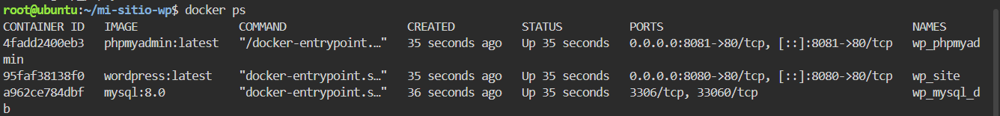
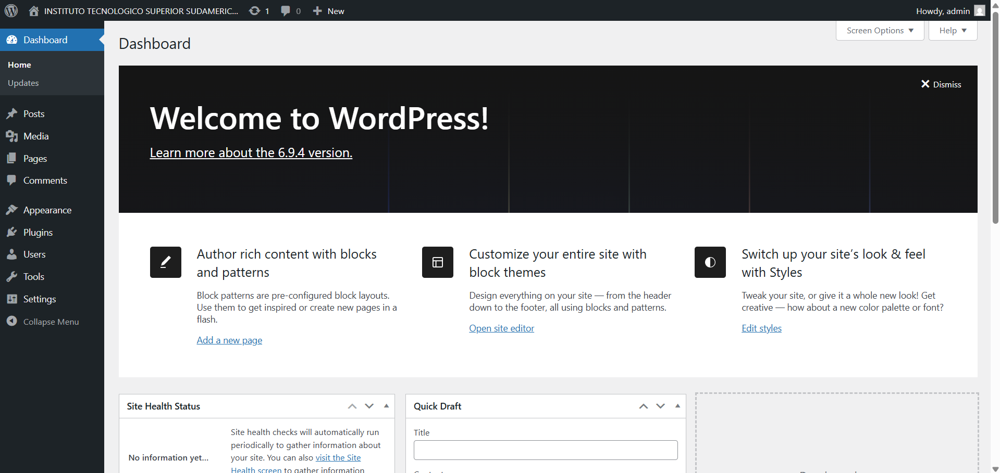
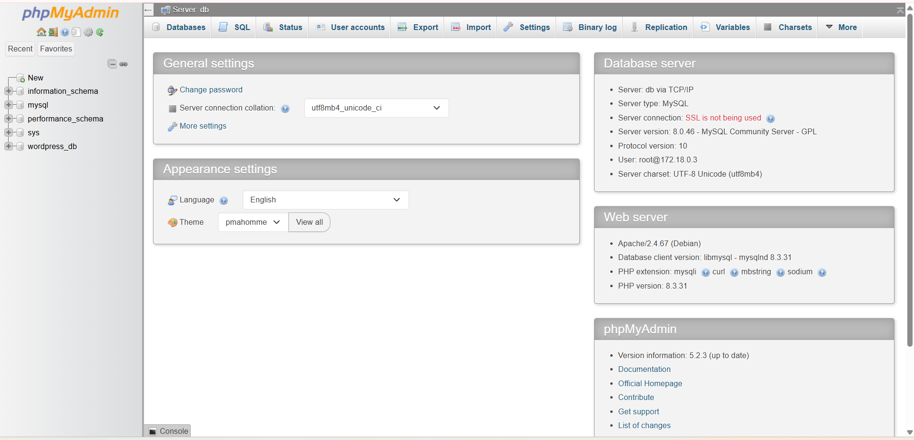

# Práctica: Wordpress con docker compose YML

## 1. Título
**Despliegue automatizado de una arquitectura de tres capas WordPress, MySQL y phpMyAdmin utilizando redes y volúmenes en Docker Compose.**


## 2. Tiempo de duración
**90 minutos**


## 3. Fundamentos

Para comprender el desarrollo de esta práctica, es indispensable dominar los conceptos clave de la tecnología de contenedores. A diferencia de la virtualización tradicional, donde cada máquina virtual (VM) requiere un sistema operativo invitado completo, la contenedorización permite que múltiples aplicaciones compartan el mismo núcleo del sistema operativo anfitrión. Esto se traduce en un consumo de recursos drásticamente menor, arranques en cuestión de segundos y una portabilidad absoluta entre entornos de desarrollo, pruebas y producción.

### El Ecosistema Docker y sus Componentes

Docker funciona bajo un modelo cliente-servidor. El Docker Daemon es el servicio en segundo plano que gestiona los objetos de Docker, como las imágenes, los contenedores, las redes y los volúmenes. Una Imagen de Docker es una plantilla de solo lectura que contiene las instrucciones para crear un contenedor. Estas imágenes se componen de capas superpuestas y se descargan desde repositorios públicos como Docker Hub. Un Contenedor es la instancia ejecutable y viva de esa imagen, corriendo en un entorno aislado.

### Orquestación Local con Docker Compose

Cuando una aplicación requiere múltiples servicios interactuando entre sí (como un frontend web, una base de datos y un administrador), gestionarlos con comandos individuales de Docker se vuelve ineficiente. Docker Compose es una herramienta que permite definir y correr aplicaciones multi-contenedor mediante un único archivo de configuración en formato YAML (`docker-compose.yml`). En este archivo se especifican de forma declarativa los servicios, los puertos expuestos, las variables de entorno y las dependencias de arranque (`depends_on`).

### Redes y Volúmenes: Comunicación y Persistencia

Por defecto, los contenedores son efímeros; si un contenedor se destruye, todos los datos generados en su interior se pierden. Para solucionar esto, Docker implementa Volúmenes, que son mecanismos de almacenamiento que conectan una carpeta interna del contenedor con el disco de la máquina anfitriona, garantizando la persistencia de los datos.

Por otro lado, el aislamiento se logra mediante las Redes de Docker. Al asociar contenedores a una misma red privada virtual, Docker habilita un sistema de resolución de nombres DNS interno. Esto permite que el servicio web se conecte al motor de la base de datos utilizando simplemente el nombre del servicio (por ejemplo, `db`) en lugar de direcciones IP dinámicas, restringiendo el acceso no deseado desde redes externas y aumentando la seguridad del sistema.


## 4. Conocimientos previos

Para realizar esta práctica de manera óptima, el estudiante necesita tener claros los siguientes temas:

- **Comandos básicos de Linux:** Navegación por directorios (`cd`, `mkdir`), gestión de archivos (`cat`, `ls`) y ejecución de scripts.
- **Formato YAML:** Reglas de indentación y estructuración de datos mediante espacios.
- **Conceptos de Redes:** Mapeo de puertos (`host:contenedor`), protocolos TCP/IP y funcionamiento básico de servicios web (HTTP/puerto 80).
- **Manejo del navegador:** Uso de herramientas de desarrollo y acceso a servicios mediante puertos específicos en entornos locales o virtuales.


## 5. Objetivos a alcanzar

- Implementar un entorno web multi-contenedor utilizando WordPress, MySQL y phpMyAdmin de forma integrada.
- Manipular archivos de configuración en formato YAML para estructurar de manera lógica la infraestructura.
- Configurar volúmenes independientes para asegurar la persistencia de datos de la aplicación y el motor de base de datos.
- Desplegar una red virtual tipo `bridge` para el aislamiento y comunicación segura entre los servicios.


## 6. Equipo necesario

- Computador con sistema operativo Windows.
- Conexión estable a Internet.
- Navegador web actualizado.
- Entorno interactivo virtualizado basado en la nube Killercoda con Docker y Docker Compose preinstalados.


## 7. Material de apoyo

- Documentación oficial de Docker:  
  https://docs.docker.com/

- Documentación de Docker Compose:  
  https://docs.docker.com/compose/

- Hoja de referencia de comandos Linux (Linux Cheat Sheet).


# 8. Procedimiento

## Paso 1: Creación del directorio de trabajo

Acceder a la terminal de Linux en el entorno de Killercoda y ejecutar el comando para crear una carpeta dedicada al proyecto con el fin de evitar conflictos de archivos. Posteriormente, ingresar al directorio creado:

```bash
mkdir mi-sitio-wp && cd mi-sitio-wp
```

## Paso 2: Creación del archivo de configuración YAML

Para estructurar el archivo sin depender de un editor gráfico, ejecutar el flujo de entrada `cat << 'EOF'` en la terminal. Copiar y pegar el bloque de configuración completo que define los tres servicios, los volúmenes y la red virtual:

```bash
cat << 'EOF' > docker-compose.yml
version: '3.8'

services:
  db:
    image: mysql:8.0
    container_name: wp_mysql_db
    restart: always
    environment:
      MYSQL_ROOT_PASSWORD: 090306
      MYSQL_DATABASE: wordpress_db
      MYSQL_USER: wp_user
      MYSQL_PASSWORD: 090306
    volumes:
      - db_data:/var/lib/mysql
    networks:
      - wp_network

  wordpress:
    image: wordpress:latest
    container_name: wp_site
    restart: always
    depends_on:
      - db
    ports:
      - "8080:80"
    environment:
      WORDPRESS_DB_HOST: db:3306
      WORDPRESS_DB_USER: wp_user
      WORDPRESS_DB_PASSWORD: 090306
      WORDPRESS_DB_NAME: wordpress_db
    volumes:
      - wp_data:/var/www/html
    networks:
      - wp_network

  phpmyadmin:
    image: phpmyadmin:latest
    container_name: wp_phpmyadmin
    restart: always
    depends_on:
      - db
    ports:
      - "8081:80"
    environment:
      PMA_HOST: db
      MYSQL_ROOT_PASSWORD: 090306
    networks:
      - wp_network

volumes:
  db_data:
  wp_data:

networks:
  wp_network:
    driver: bridge
EOF
```


## Paso 3: Verificación de la escritura del archivo

Confirmar que el archivo se guardó íntegramente imprimiendo su contenido en la pantalla de la terminal con el comando:

```bash
cat docker-compose.yml
```


## Paso 4: Despliegue de los contenedores

Ejecutar el comando de Docker Compose adaptado a la sintaxis del entorno de Killercoda, añadiendo el parámetro `-d` para delegar la ejecución al segundo plano:

```bash
docker-compose up -d
```

Esperar a que finalice la descarga de capas de las imágenes desde Docker Hub hasta que la terminal indique el estado iniciado de cada servicio.


## Paso 5: Diagnóstico y verificación del estado operacional

Comprobar el estado físico de los contenedores y el mapeo correcto de los puertos mediante el comando de control de Docker:

```bash
docker ps
```

## Paso 6: Configuración del CMS WordPress

Abrir la utilidad de gestión de puertos expuestos de Killercoda (*Traffic Ports*), ingresar el puerto `8080` y proceder con la selección de idioma y creación del usuario administrador del sitio web dentro de la interfaz gráfica cargada.

## Paso 7: Verificación del motor de base de datos MySQL

Abrir una nueva pestaña de tráfico utilizando el puerto `8081` para cargar phpMyAdmin. Autenticarse utilizando el usuario `root` y la clave establecida para verificar la generación automática de las tablas dentro del esquema `wordpress_db`.


# 9. Resultados esperados

Al finalizar la práctica se espera que el estudiante demuestre el correcto despliegue del ecosistema técnico adjuntando las siguientes capturas:

### Captura 1 (Terminal)
Salida del comando `docker ps` que liste con éxito los tres contenedores en estado activo:


### Captura 2 (Navegador - Puerto 8080)


### Captura 3 (Navegador - Puerto 8081)



# 10. Bibliografía

- Docker. (2024). *Docker Compose overview*. Docker Documentation.  
  https://docs.docker.com/compose/

- Turnbull, J. (2014). *The Docker Book: Containerization is the new virtualization*. James Turnbull.

- Warner, J., & Harris, S. (2020). *WordPress All-in-One For Dummies*. John Wiley & Sons.
